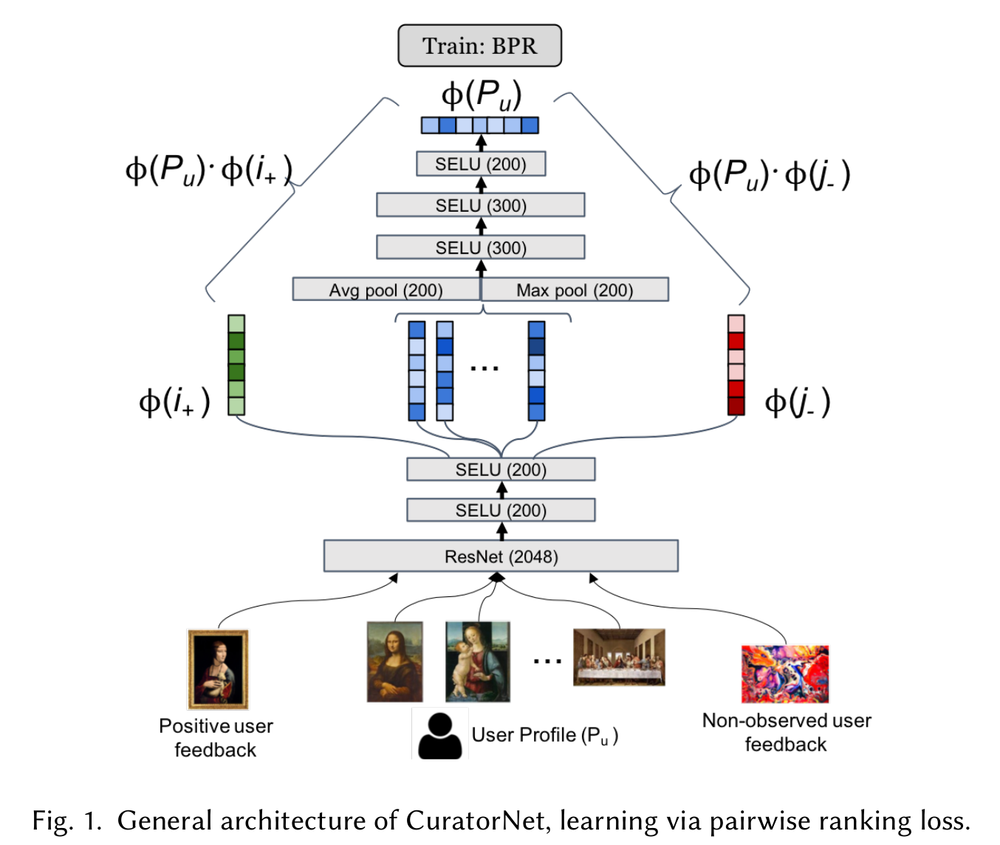
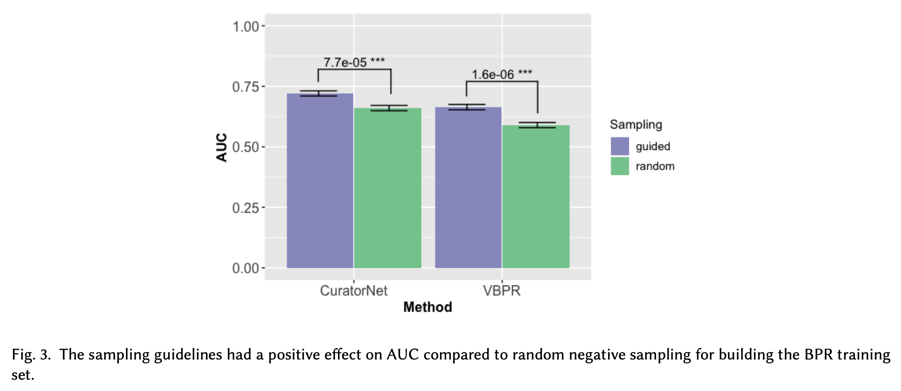
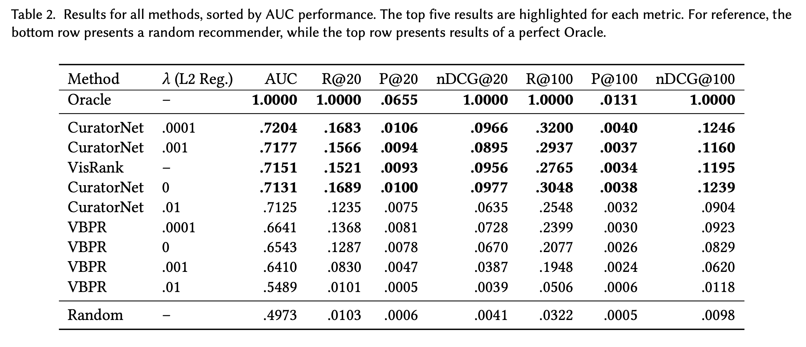

# CuratorNet: Visually-aware Recommendation of Art Images

### Manuel Cartagena<sup>1</sup>, Patricio Cerda<sup>1</sup>, Pablo Messina<sup>1,2</sup>, Felipe Del Río<sup>1,2</sup>, Denis Parra<sup>1,2</sup>

#### <sup>1</sup> Pontificia Universidad Católica de Chile
#### <sup>2</sup> IMFD: Millenium Institute Foundational Research on Data

___
## Introduction

We introduce CuratorNet, a neural network architecture for visually-aware recommendation of art images.

CuratorNet is designed with the goal of maximizing generalization: the network has a fixed set of parameters that only need to be trained once, and thereafter the model is able to generalize to new users or items never seen before, without further training. This is achieved by leveraging visual content: items are mapped to item vectors through visual embeddings, and users are mapped to user vectors by aggregating the visual content of items they have consumed.

In this repository, we provide a TensorFlow implementation of CuratorNet.

The full paper pre-print is available at [arXiv](https://arxiv.org/abs/2009.04426), and is part of the ComplexRec workshop proceedings at the ACM RecSys 2020 conference.

## Citation

If you find this repository useful for your research, please consider citing our paper: 
```
@inproceedings{curatornet2020,
    author = {Manuel Cartagena and Patricio Cerda and Pablo Messina and Felipe Del Río and Denis Parra},
    title = {CuratorNet: Visually-aware Recommendation of Art Image},
    year = {2020},
    url = {https://arxiv.org/abs/2009.04426},
    booktitle = {Proceedings of the Fourth Workshop on Recommendation in Complex Environments},
    keywords = {visual art, deep learning, recommender systems},
    location = {Virtual Event, Brazil},
}
```


## Folder structure

In `/experiments`, you can find all notebooks necessary for replicating our results.

In `/src`, you can find the CuratorNet implementation.

## To try it out
Execute the following commands from the main folder:
- `virtualenv -p python3 ./env`
- `source ./env/bin/activate`
- `pip install -r requirements.txt`
- `ipython kernel install --name "CuratorNetKernel" --user`
- `jupyter notebook`

Train CuratorNet:
- Execute notebook `experiments/training.ipynb`

Precompute embeddings:
- Execute notebook `experiments/precomputation.ipynb`

Evaluate CuratorNet:
- Execute notebook `experiments/evaluation.ipynb`

Compute peformance metrics:
- Execute notebook `experiments/metrics.ipynb`

In each notebook:
- `Kernel -> Change kernel -> CuratorNetKernel`
- `Cell -> Run All`

## How does it work

CuratorNet leverages neural image embeddings obtained from pre-trained CNNs. We train CuratorNet to rank triplets that associate a user with a pair of images: one where we have positive feedback from said user, and one where we do not.  



CuratorNet draws inspiration from [VBPR](https://arxiv.org/abs/1510.01784) and [Youtube’s Recommender System](https://static.googleusercontent.com/media/research.google.com/es//pubs/archive/45530.pdf): we optimize for ranking using triplet loss, and seek generalization to new users without introducing additional parameters or further training. We also propose a set of sampling guidelines to generate triplets for training our model, which improves the performance of CuratorNet and VBPR with respect to random negative sampling.



To test our approach, we use an anonymised dataset of art purchases in an e-commerce website. Each transaction associates a user's ID with the ID and visual embedding of the painting that she bought. This dataset can be downloaded to train and evaluate CuratorNet, as seen in the table below. Although the artwork itself is not included, CuratorNet's architecture enables usage with any other dataset once trained.


